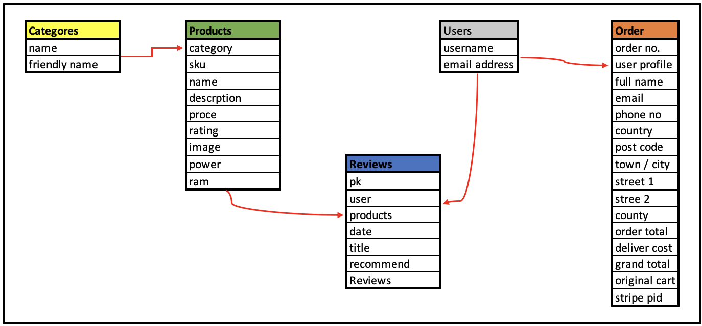
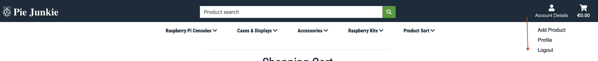
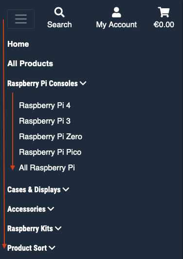
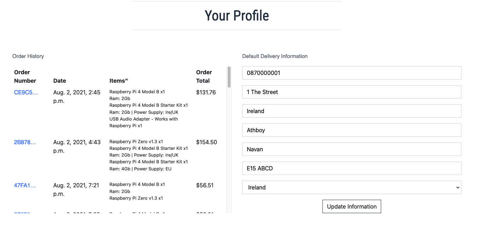

# **Pie Junkie - Raspberry Pi Store** 

<a href="https://pie-junkie.herokuapp.com"></img></a>

This project is an e-commerce site developed to for Raspberry Pi products developed for submission as my Milestone 4 project
as part of the Diploma in Software Development with the <a href="https://codeinstitute.net/" target="_blank">Code Institute</a>,
 the live version of the site deployed on Heroku is available <a href="https://pie-junkie.herokuapp.com" target="_blank">HERE</a>

## Index

- [Project Goals](#Project_Goals)
- [User Stories](#User_Stories) 
    - [Customer](#Customer)
    - [Site Owner](#Site_Owner)
- [Wireframes](#Wireframes)
- [Features](#Features)
    - [Models](#Models)
    - [Base Template](#Base_Template)
    - [Apps](#Apps)
    - [Existing Features](#Existing_Features)
    - [Future Enhancements](#Future_Enhancements)
- [Technologies Used](#Technologies_Used)
- [Testing](#Testing)
    - [UX Testing](#UX_Testing)
    - [Functional Testing](#Functional_Testing)
    - [User Testing](#User_Testing)
    - [Code Validation](#Code_Validation)
- [Deployment](#Deployment)
    - [Live Deployment](#Live_Deployment)
    - [Local Deployment](#Local_Deployment)
- [Database](#Database) 
- [Credits](#Credits)
    - [Content](#Content)
    - [Media](#Media)
    - [Acknowledgements](#Acknowledgements)

- - - -
## **<ins>Project_Goals</ins>**
The Goal of the project is to develop and deploy an e-commerce store for a fictional online supplier of Raspberry Pi modules and products. 

**Project Requirements;**
- Develop a site that is initituitve and easy to use for customers without and instructions
- Ensure that products on the site can be easily added and edited by an admin user.
- Demonstrate my knowledges and skills by building a full-stack site that includes;
    HTML, CSS, Python & Javascript built on the Django frame work.
- Showcase my skills in design to build a site that is inviting to customers and best showcases the products being sold.

## <ins>User_Stories</ins>

### **Customer;**

As a customer I want to;
1. view Raspberry Pi products that I might be interested in buying
2. navigate the site with ease, view products by categories, search for items I am looking for.
3. view details of the products that I am interested in.
4. see review of products from other customers, leave my own review
5. add products to my cart as I browse the site and see a running total of the cost.
6. review the contents of my cart with ability to adjust quantities or remove items before I check out.
7. have a secure checkout, that ensures my credit card details are safe.
8. have the ability to create an account and save my details for return visits
9. confirmation of my order once places and details emailed to me as a record

### **Site_Owner;**

As the owner I want to;
1. provide a site that is inviting to customers, easy to use and intuitive to navigate
2. provide customers with a method to leave reviews on products and view reviews from other customers
2. allow customers to checkout without needing to register but include the option to to register and save details if they wish to.
3. add new products to the site
4. be able to edit or remove existing products as required
5. ensure the site is secure, limit actions based on login profiles (add / edit / delete products | write / edit / delete review)
6. provide a secure method for payment processing to protect customer payment details and site reputation

## <ins>Wireframes</ins>
During the planning stage of the project, wireframes were drawn up for each of the pages of the site.
The wireframes, (linked below) were used as guides during the development with some minor tweaks during the build process
to improve the site.

| Title | Link to Wireframe (pdf) |
| --- | --- |
| Wireframes | <a href="https://app.box.com/s/4rylun14revkk27psyoy68ejt7n5canp" target="_blank">Pie Junkie Wirerames</a>|

[Index](#Index)
- - - -

## **<ins>Features</ins>**
The site has a simple structure that makes it easy for new customers understand and navigate. The inclusion of an optional registration and authentication system allows returning customers save their details and view past orders. Registraton is not necessary to complete and order, rather an optional feature.

### **<ins>Models</ins>**
The Pie Junkie site has 5 models in the DB, each linked with foreign keys from other models where required to link entries across the models. 

Models Structure

        
    

**Dteails of Models;**

**Categories**

    Provides a list of categories that the products on the site can be categories under, to allow the creation of categorisation of products on the site for the customer

- **Products**

    The products models contains all the information on each product. Included in the site is a admin page "add product" that a superuser can use to add products to this model. In additional an authenticated superuser also has the option to edit or delete a product directly from the products details page.

- **Reviews**

    The review models contains all the customer reviews submitted link to the relevant product. Reviews are displayed to all customers (regardless of login status). Users that are registered and login can post a review and have the option to edit or delete their previous reviews.

- **Users**

    The users models contains all the information on registered users. It also holds all the customers default deliver information if they choose to save it.

- **Order**

    Order model contains all the orders that have been places successfully. The orders are linked to the user (if authenticated at the time) that places the order, this enabled a past order history summary in the profile app.

## **<ins>Base_Templates</ins>**

    The site utilises a base template, that all the app templates are extended off. 
    
    - **Base Template Header**

    The header and footer. The header contains the site name (as a home link), a search bar, a user menu and shopping cart. The search option, searches all products within both the product title and description. 
    The user menu varies depending on login status and user type. 
    A super users, sees an add product option.
    
    

Base Template Header

        
    

    On mobile, the headers is compressed in to a more mobile friendly display, it also incorporates the product filter menu into a 3 bar icon, this can be expanded to display the options. 

    

Base Template Header Mobile

        
    

    - **Base Template Footer**
    The footer displays the company name and link to the Raspberry Pi home page. It also has social media link. The footer is dynamic, it is at the bottom of the screen when the page content is less than a full screen but moves down as the page content expands to maximise the screen size for main site information.

    

Base Template Footer

        
    

    - **Product Navigation Menu Template Footer**
    The product naviagtion menu allows the customer to filter by categories.

     

Product Navigation

        
    

## **<ins>Apps</ins>**
The site consists od 5 individual apps within the main Django framework. The apps all extend off the base templates with an included production navigation menu. 

- **Profile**

    The rpoflie app linked to the profile model,  provies a page where login user can  view and edit their default deliver information. 
    The proflie app also, get information from the order model and displays past orders for the user. 

    

Profile Page

        
    

- Home

    The home app is the main home pahe (index.html) page for the site. It diplays information on raspberry pi articles and tutroilas to help inform the costomers with information on the Raspberry Pis and tutorials on what they can do with the products that they purchase.

    

Home Page

        
    

    
- Products

    The products app contains a number of pages, for displaying products, details of the products and user reviews. Products can be filtered based on the selected categorie selcetd. All products view can be sorted by prices. cartegory & rating (in bot assending & decending order)
        
    1. Products page, displays all products in the DB.

    

Products Page

        
    

    2. Detail page, that provides all products details to the customer. 

    The details page also provides the interface to select the quantity and add the product to the cart.

    

Details Page

        
    

    

Customer Reviews

        
    

    The products app contains three modles;
    
    1. categories
    2. products
    3. reviews    
       
- Cart
- Checkout

### <ins>Existing_Features</ins>
The following featuures have been implemented in the current deployment of the e-commerce site.
Features described in the user stories have been priortised for the inital deployment
**User;**

**Admin**

### <ins>Future_Enhancements</ins>

In addition to the existing features, some future planned features included.

**User;**

**Admin**

[Index](#Index)
- - - -
## <ins>Technologies_Used</ins>
**Balsamiq**  https://balsamiq.com/wireframes/
- Basamiq was used in the design phase to create wireframes of the proposed web site.

**Github** https://github.com/
- Github is the repository used for version control & storage of the project.
- Github pages was used for the deployment of the site.

**Gitpod** https://www.gitpod.io/
- Gitpod was the IDE used for the development throughout the project.

**Heroku** https://id.heroku.com/login
- Heroku cloud used for hosting the live application

**Amazon Web Services** https://aws.amazon.com
- Used to host static files and media images for the site

**Google Fonts** https://fonts.google.com/
- Google fonts provided fonts for the project (Roboto Condensed & Serrat)

**Bootstrap** https://getbootstrap.com/
- CSS Framework

**Font Awesome** https://fontawesome.com/
- Icons used through the web site are sourced from Font Awesome

**Django** https://www.djangoproject.com/
- Open source web framework.

**Python3** https://www.python.org/
- Backend programming language, use in Django

**jQuery** https://jquery.com/
- jQuery Javascript for additional functionality on the site

**SQLite** https://www.sqlite.org/index.html
- SQLite DB (integrated in Django) use as the DB in development environment

**PostgreSQL** https://www.postgresql.org/
- PostgreSQL DB (integrated in Heroku) use as the DB in production environment

**Stripe** https://stripe.com
- For payment processing

**Stripe** https://stripe.com
- For payment processing

**W3C Validation Service** https://validator.w3.org/
- HTML & CSS code was checked on W3C validator at the end of the project.

**HTML Formatter** https://webformatter.com/html
- HTML code was run through HTML formatter to fix any indentation issues.

**JSHint** https://jshint.com/
- JavaScript code validate through JSHint

**ami.responsivedesign** http://ami.responsivedesign.is/#
- The project was tested on ami.responsivedesign
- image used in readme file was taken from ami.responsivedesign site

**w3schools** https://www.w3schools.com
- For additional code explanations & features to use.

[Index](#Index)
- - - -
## <ins>Testing</ins>

### <ins>UX_Testing</ins>
As part of the UX testing all pages were tested for the following criteria;

| Page | Desktop | Tablet | Mobile | Issues |
| --- | --- | --- | --- | --- |

[Index](#Index)
### <ins>Functional_Testing</ins>

[Index](#Index)

## **<ins>User_Testing</ins>**

### <ins>Code_Validation</ins>

|Code| Testing| Tool| Link|
| --- | --- | --- | --- |

[Index](#Index)
- - - -

## <ins>Deployment</ins>

### <ins>Live_Deployment</ins>

### <ins>Local_Deployment</ins>

[Index](#Index)
- - - -
## **<ins>Database</ins>**

[Index](#Index)
- - - -

### <ins>Acknowledgements</ins>
| Name | Area | Description |
| --- | --- | --- |
| Rahul Lakhanpal | Project Mentor | For all the guidance and input on UK and guiding me through the project with advise and direction. |
| Caroline Taylor | Testing | For help with User Testing and feedback |
|MongoDB | DB Hosting | For providing a free backend DB for the application|
|Heroku | Live Site Hosting |For providing a free cloud environment to host the application|

[Index](#Index)
- - - -
