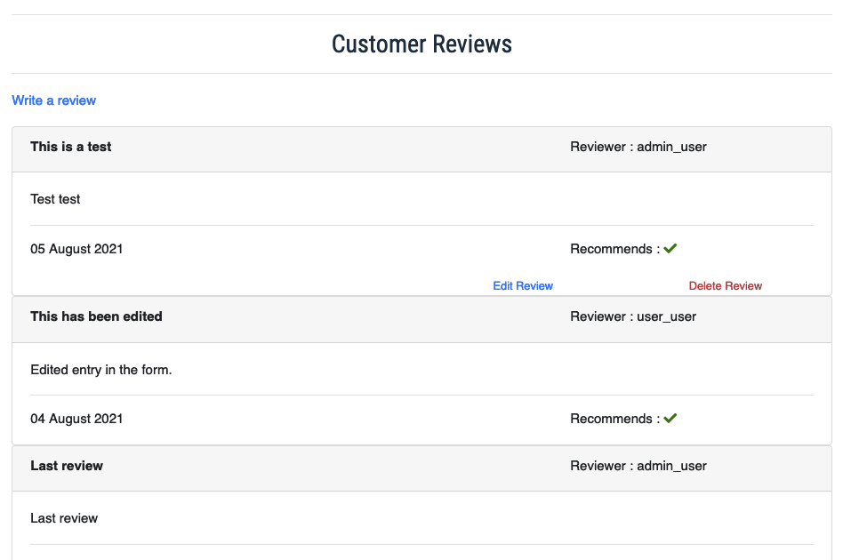
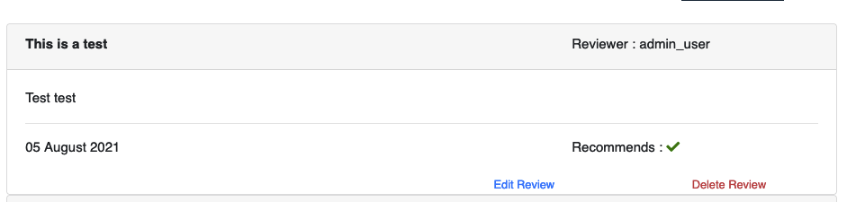

# **Pie Junkie - Raspberry Pi Store** 

<a href="https://pie-junkie.herokuapp.com"></img></a>

This project is an e-commerce site developed for Raspberry Pi products and was developed for submission as my Milestone 4 project
as part of the Diploma in Software Development with the <a href="https://codeinstitute.net/" target="_blank">Code Institute</a>,
 the live version of the site is deployed on Heroku and available <a href="https://pie-junkie.herokuapp.com" target="_blank">HERE</a>

<a href="https://pie-junkie.herokuapp.com"></img></a>

## Index

- [Project Motivation](#Project_Motivation)
- [UX](#UX) 
    - [User Stories](#User_Stories)
    - [Wireframes](#Wireframes)
- [Features](#Features)
    - [Existing Features](#Existing_Features)
    - [Future Enhancements](#Future_Enhancements)
- [Technologies Used](#Technologies_Used)
- [Testing](#Testing)
    - [UX Testing](#UX_Testing)
    - [Functional Testing](#Functional_Testing)
    - [User Testing](#User_Testing)
    - [Code Validation](#Code_Validation)
- [Deployment](#Deployment)
    - [Live Deployment](#Live_Deployment)
        - [Heroku App Set-up](#Heroku_App_Set-up)
        - [AWS S3 Bucket Set-p](#AWS_S3_Bucket_Set-up)
    - [Local Deployment](#Local_Deployment)
- [Credits](#Credits)
    - [Content](#Content)
    - [Media](#Media)
    - [Acknowledgements](#Acknowledgements)

- - - -
## **<ins>Project_Motivation</ins>**
The project was motivated by the need to develop an e-commerece store to demonstrate my knowledge of Django
I decided on a site selling raspberry pi products and called it The Pie-Junkie.

## **<ins>UX</ins>**

### <ins>User_Stories</ins>

**Customer;**

As a customer I want to;
1. view Raspberry Pi products that I might be interested in buying
2. navigate the site with ease, view products by categories, search for items I am looking for.
3. view details of the products that I am interested in.
4. see reviews of products from other customers, leave my own review
5. add products to my cart as I browse the site and see a running total of the cost.
6. review the contents of my cart with ability to adjust quantities or remove items before I check out.
7. have a secure checkout, that ensures my credit card details are safe.
8. have the ability to create an account and save my details for return visits
9. confirmation of my order once placed and details emailed to me as a record

**Site Owner;**

As the owner I want to;
1. provide a site that is inviting to customers, easy to use and intuitive to navigate
2. provide customers with a method to leave reviews on products and view reviews from other customers
2. allow customers to checkout without needing to register but include the option to register and save details if they wish to.
3. add new products to the site
4. be able to edit or remove existing products as required
5. ensure the site is secure, limit actions based on login profiles (add / edit / delete products | write / edit / delete review)
6. provide a secure method for payment processing to protect customer payment details and site reputation

### <ins>Wireframes</ins>
During the planning stage of the project, wireframes were drawn up for each of the pages of the site.
The wireframes, (linked below) were used as guides during the development with some minor tweaks during the build process
to improve the site.

| Title | Link to Wireframe (pdf) |
| --- | --- |
| Wireframes | <a href="https://app.box.com/s/4rylun14revkk27psyoy68ejt7n5canp" target="_blank">Pie Junkie Wirerames</a>|

[Index](#Index)
- - - -

## **<ins>Features</ins>**
The site consists of 5 individual apps within the main Django framework. 
- Profile

    Contains the profile page that allows an authenticated customer to save their delivery details and 
    view a list of past orders

    

Profile Page

        
    

     

- Home

    Home app, conatins the main home (index.html) page with links to information and tutroials on Raspberry Pi
    
    

Home Page

        
    

     

- Products

    The producs app contains all the producs, filter options (filter by product types, ) and sort options.
    The site consists of two html pages, 
        
    1. Products page, displays all products in the DB.
    Products are displayed in a bootstrap card with the number per row, varying depending on screen size. The image for  each product is a link to open the details for the selected product.

    

Products Page

        
    

     

    2. Detail page, that provides all products details to the customer. 

    The details page also provides the interface to select the quantity and add the product to the cart.

    

Details Page

        
    

     

    Two additional elements in the product model, Ram & Power are selectable from the details page. When a product has either or both options set in the DB additional options are included on the page. Allowing the customer to select the option; Ram - Options > 2Gb / 4Gb / 8Gb Power - Options > Ire_Up / EU / Europe

    3. User Reviews
    Integrated into the products details page, is a customer review section. This section of the page displays any reviews in the DB for the current product. If the user is logged in they have the option to write a review, other wise they are invited to login to create a review.

    

Customer Reviews

        
    

     
    
    3.1. Write a Review The write a review form is integrated into the details form and opens using jQuery when the customer wants to write a review. In the review model, it records the user that submits the review and the product it is written for.

    

 Reviews

        
    

     

    3.2. Edit / Delete a review: Customers that wrote a review can see two options within their review. Only reviews submitted by the current users have the delete & edit options shown. additionally the views file has a login required check to prevent others circumventing the hidden options.
    Review Options Reviews

    

 Review Options

        
    

     

    Delete The delete link will delete the review from the DB and reload the page on the same product.

    Edit The edit option will open a new page with the review form refilled with the review data, which the customer can edit and resubmit to the DB.
    Edit Reviews

    

Edit Review

        
    

     

- Cart
    The shopping cart page provides the customer with a summary of their items before they move to the checkout screen. While in the cart, the customer can adjust the quantity of any product or remove the product entirely. Once updates are process the customer will see the updated cart totals and shipping cost for their cart before moving to check out. 
   
    

Cart Page

        
    

     

- Checkout
    The checkout screen consists of three major elements;
    1. Delivery Details
    
    A table for the customer to provide their shipping address and contact details. 
    For a login / registered user this data can be pulled from their profile app.
    Includes option to save delivery details as default delivery in profile

    2. Payment card details

    The payment details form, integrated to Stripe where the customer can securely enter their card details. Card details are sent to stripe for processing and never saved on the site for security reasons.

    3. Summary of the order

    The checkout page also provides a summary of the order that is being process, the customer can see all the details of what there order consists of and the cost of each product and total cart cost.

    Note: On mobile, the page is rearranged to better suit mobile, the order summary is moved to the bottom of the screen below the forms. 

    

Checkout Page

        
    

     

    **Order Successful**
    Once the order has been successfully processed the customer is taken to the order successful page. The order number for the placed order is provided, a summary of the order and confirmation that an e-mail with the details have been sent.
    
    

Checkout Success Page

        
    

     

### <ins>Existing_Features</ins>
Based on the user stories, the following features are included in this deployment of the site

**User;**
- View all products
- view products by categories
- customer reviews - view all reviews by product. Add your own review, edit & delete your reviews
- add contents to cart, review and adjust cart directly from cart page
- secure checkout, using stripe payments
- account creation. save default deliver information, view past orders
- e-mail confirmation of order

**Admin**

- a complete e-commerce site, with intuitive navigation and understanding for customers
- secure customer payment system via Stripe linked to my account.
- DBs for products, orders and users.
- form to add a new product to the DB.
- options from products details page to edit product details or delete the product from the DB.

### <ins>Future_Enhancements</ins>

While the current deployment meet all the requirements from the user stories, there are some more features that could be added to improve the e-commerce store.

**User;**
- login linked to social media account for ease of loging and registration
- information on any products that are on sale.
- ability to view new products that have been added recently

**Admin**
- Additional fields in the order model that would allow the team managing the store to indicate when an     order has been picked and shipped and allow a view of what orders are still to be actioned.
- additional user groups to allow additional store employees to have access to additional features without he need to have superuser access.
- a newsletter feature that users could signup to, which would allow site owner push regular information to customers to promote products and the store.

The future enhancement features would be the main areas of focus for the next version of the site.

[Index](#Index)
- - - -
## <ins>Technologies_Used</ins>
**Balsamiq**  https://balsamiq.com/wireframes/
- Basamiq was used in the design phase to create wireframes of the proposed web site.

**Github** https://github.com/
- Github is the repository used for version control & storage of the project.
- Github pages was used for the deployment of the site.

**Gitpod** https://www.gitpod.io/
- Gitpod was the IDE used for the development throughout the project.

**Heroku** https://id.heroku.com/login
- Heroku cloud used for hosting the live application

**Amazon Web Services** https://aws.amazon.com
- Used to host static files and media images for the site

**Google Fonts** https://fonts.google.com/
- Google fonts provided fonts for the project (Roboto Condensed & Serrat)

**Bootstrap** https://getbootstrap.com/
- CSS Framework

**Font Awesome** https://fontawesome.com/
- Icons used through the web site are sourced from Font Awesome

**Django** https://www.djangoproject.com/
- Open source web framework.

**Python3** https://www.python.org/
- Backend programming language, use in Django

**jQuery** https://jquery.com/
- jQuery Javascript for additional functionality on the site

**SQLite** https://www.sqlite.org/index.html
- SQLite DB (integrated in Django) use as the DB in development environment

**PostgreSQL** https://www.postgresql.org/
- PostgreSQL DB (integrated in Heroku) use as the DB in production environment

**Stripe** https://stripe.com
- For payment processing

**W3C Validation Service** https://validator.w3.org/
- HTML & CSS code was checked on W3C validator at the end of the project.

**HTML Formatter** https://webformatter.com/html
- HTML code was run through HTML formatter to fix any indentation issues.

**JSHint** https://jshint.com/
- JavaScript code validate through JSHint

**ami.responsivedesign** http://ami.responsivedesign.is/#
- The project was tested on ami.responsivedesign
- image used in readme file was taken from ami.responsivedesign site

**w3schools** https://www.w3schools.com
- For additional code explanations & features to use.

[Index](#Index)
- - - -
## <ins>Testing</ins>

Testing is documented in the testing.md file.
Full details of the testing are available there.

[Index](#Index)
- - - -

## <ins>Deployment</ins>

This e-commerce store has been built using gitpod, and using github as the version control. Heroku has been chosen as the cloud environment to deploy the live site. In additional to Heroku, Amazon Web Service (AWS) cloud has been chose to host the static files (css) and media file (product images, etc) which is then linked to the Heroku app.

### <ins>Live_Deployment</ins>
As we are deploying the site on Heroku and hosting the static and media files on AWS, we will need to set-up both to deploy the site live. The following are the steps to set-up both environments

### <ins>Heroku_App_Set-up</ins>

Heroku provides a free tier of access, this free tier is being used for the deployment of this project.
To create your account, visit  <a href="www.heroku.com" target="_blank"> www.heroku.com</a> and create your free account.
Once you have your account set-up, the following steps can be followed to set-up an app on Heroku;
1. On Heroku, select create New App.
2. Enter the name for your app (note the name will be used as part of the url for the site)
3. Select the region you want your project deployed on. (I chose Europe option as I am based in Europe)
4. Once the app is created, in the resources tab of the newly created app, you will need to set-up your database for production environment. Add Heroku Postgres for the database
5. On your project (in gitpod for me) you will need to install dj_database_url and psycopg2-binary to use Heroku Postgres (freeze your requirements again to ensure Heroku knows to install them)
6. You will need to migrate your DBs from the Dev DB to the production DB.
    In settings.py update DATABASE to point to your postgress DB in Heroku.
    > DATABASES = {'default: dj_database_url.parse("place you Heroku DB link here)}
    Heroku DB link can be retrieved from the Settings Tab, under config vars.
7. Migrate the DB to your production DB.
    I did not migrate any products and set-up products in the new site, as I only have test data on the development environment
    > python3 manage.py showmigrations
    > python3 manage.py migrate
8. Create a superuser account on the new production DB so you have access to update it.
    > python3 manage.py createsuperuser
9. Install gunicorn to be used as the web server on Heroku (freeze requirements)
10. Create a procfile (name : Procfile) and add:
    > web: gunicorn pie_junkie.wsgi:application
11. At this point, AWS instance is not set-up for static files so you can temporally disable collect static on Heroku
> heroku config:set DISABLE_COLLECTSTATIC = 1

12. At this point, you will need to configure your project to use the Heroku Postgres DB in production. In the settings. py file, configure DATABASES are per below image to direct to the correct DB in production or development. This set-up ensures that the site continues to the work in both dev and production.

DATABASES Settings

        
    

     

13. Commit and push your changes to Github
14. On Heroku app, deploy tab, link the app to your Github repository.
    You can also enable automatic deploy to pickup any changes pushed to Github.

**Note:** On your Heroku app, you will need all the same config vars that you are using in development added. Refer to the config vars on your local system and replicate them on Heroku

### <ins>AWS_S3_Bucket_Set-up</ins>

1. Login to <a href="https://aws.amazon.com/" target="_blank"> AWS</a>, if you don’t have an account you will need to create on. As part of the account creation you will need to supply a credit card number, this project should not exceed the free limit but do set notifications to remain in control of your spending.
2. From the management console, you can search for S3 and create a new bucket, give the bucket a name (one you will recognise for this project) and selected the region to host the bucket.
3. For basis settings, enable static website hosting and add index.html and error.html as the Index document and error document respectively. Set the bucket to be Public, this will generate a warning but the bucket needs to be public to allow access to the static and image files.
4. Set-up the CORS config for access between Heroku & S3.
5. Bucket Policy, generate a policy with AWS generator.
(you will need to add /* to end of the resource to allow access to all resources)
6. In AWS, got to IAM (Identity and Access Management) to create group, this is required as you will need to create a user in this group. For the group you can use a pre-built policy "AMAZONS3FullAccess"
Import this policy and attach the policy to the group.
7. Create a user and add the user to group created in the previous step.
At this point you will have access to a csv file with details of the user including the Access Key ID. Download this file and save somewhere safe as you will need it to complete and the file can not be downloaded at a later time.

Setting up AWS in Django
As the S3 Bucket is now set up you will need to link it to your project. 

1. Install boto3 & Django-storages (freeze the requirements)
2. In settings.py add the S3 bucket details, linking it to your bucket.
    This is only for project running in production so include an "if 'USE_AWS'
    Go to Heroku and create the config vars for AWS;

    Config Vars:
    - AWS_ACCESS_KEY_ID
    - AWS_SECRET_ACCESS_KEY
    - USE_AWS

   

USE_AWS Settings

        
    

     

3. create a custom_storages.py file
    This will be used to direct dJango to store static and images files in the S3 Bucket
4. At this point you can save, commit and push the updates to Github.

**Note:** If you have products already set-up on the production DB you will need to upload the images manually to the S3 bucket in the media folder or edit the images on the live site and add the images again.

### <ins>Local_Deployment</ins>

To Clone the repository; From the Github repository (@ https://github.com/meltaylor78/pie_junkie)

- click on the code button  and copy the link provided.
- In a Terminal or IDE
    - Change the directory to the desired location on your drive
    - Type git clone, followed by the url you copied above Note: as an alternate, Git also allows the repository to be downloaded as a zip file.

[Index](#Index)
- - - -
## **<ins>Credits</ins>**
The development of this site and store could not have happened without the help and support received. The site is a proof of concept that will be submitted as my milestone project.
I would like to acknowledge, the people and resources that made this project possible.

- - - -
## **<ins>Media</ins>**

| Details | Site | Link |
| --- | --- | --- |
| Images & Product information | The PiHut | https://thepihut.com/ |

In addition to the list above, see the [Technologies Used](#Technologies_Used) and the [Acknowledgements](#Acknowledgements) section for others that I would like 
to extend my thanks and appreciation to.

- - - -

## **<ins>Credits</ins>**

| Details | Site | Link |
| --- | --- | --- |
| Walkthrough Project - Boutique Ado | Code Institute | https://codeinstitute.net |
| Content on Raspberry Pi & Accessories | The PiHut | https://thepihut.com/ |

In particular the Walkthrough Project - Boutique Ado, the instructional videos that I had to revisit on many times as I worked through the project.

- - - -

### <ins>Acknowledgements</ins>
| Name | Area | Description |
| --- | --- | --- |
| Rahul Lakhanpal | Project Mentor | For all the guidance and input on UX design and guiding me through the project with advise and direction. |
| Caroline Taylor | Testing | For help with User Testing and feedback |

- - - -
[Index](#Index)
