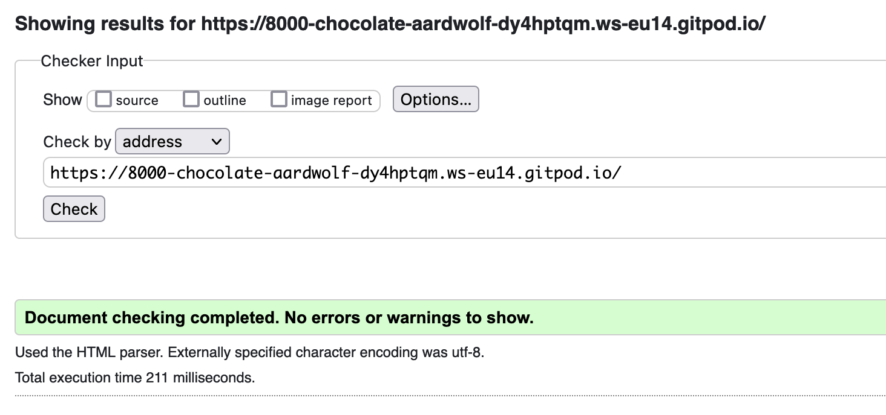
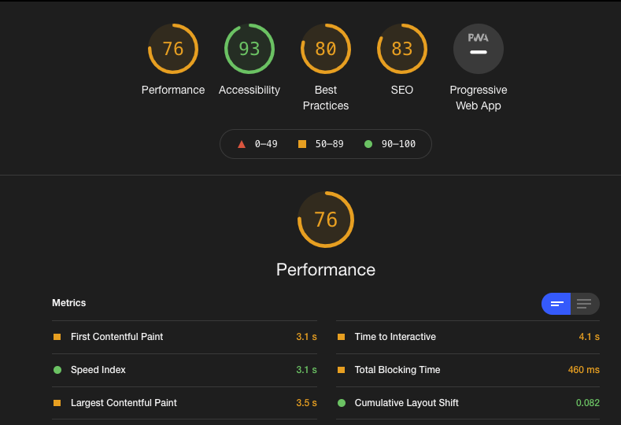

<a href="https://pie-junkie.herokuapp.com"></img></a>

- [Code Validation](#Code_Validation)
    - [HTML Code Validation](#HTML_Code_Validation)
    - [CSS Code Validation](#CSS_Code_Validation)
    - [JavaScript Code Validation](#JavaScript_Code_Validation)
    - [Python Code Validation](#Python_Code_Validation)
- [User Testing](#Code_Validation)
- [Lighthouse Report](#Lighthouse_Report)

## **<ins>Code_Validation</ins>**

### <ins>HTML_Code_Validation</ins>
HTML code for the project was validated using the <a href="https://validator.w3.org/">W3C Markup Validation Service</a>.

The inital validation test on the validation tool showed 26 errors and 4 warning. 
Many of the errors were from copying segments of code to reuse and not changing the IDs used. 

All errors have been resolved

W3C Error Report

1. Error: Element li not allowed as child of element nav in this context. (Suppressing further errors from this subtree.)   
2. Error: Element li not allowed as child of element nav in this context. (Suppressing further errors from this subtree.)
3. Error: Duplicate ID user-options.
4. Warning: The first occurrence of ID user-options was here.
5. Error: Element li not allowed as child of element nav in this context. (Suppressing further errors from this subtree.)
6. Error: Start tag a seen but an element of the same type was already open.
7. Error: Stray end tag a.
8. Error: Duplicate ID home-link.
9. Warning: The first occurrence of ID home-link was here.
10. Error: Bad value /products/?category=All Raspberry Pi,raspberry_pi_4,raspberry_pi_3,raspberry_pi_zero,raspberry_pi_pico for attribute href on element a: Illegal character in query: space is not allowed.
11. Error: Duplicate ID sccessories-link.
12. Warning: The first occurrence of ID sccessories-link was here.
13. Error: Bad value /products/?category=All Kits,game_kit,project,mini_projects for attribute href on element a: Illegal character in query: space is not allowed.
14. Error: Attribute test not allowed on element h5 at this point.
15. Error: Attribute test not allowed on element h5 at this point.
16. Error: Attribute test not allowed on element h5 at this point.
17. Error: Attribute text-b not allowed on element h5 at this point.
18. Warning: The type attribute is unnecessary for JavaScript resources.
19. Error: End tag for body seen, but there were unclosed elements.
20. Error: Unclosed element div.
21. Error: The aria-labelledby attribute must point to an element in the same document.
22. Error: The aria-labelledby attribute must point to an element in the same document.
23. Error: The aria-labelledby attribute must point to an element in the same document.
24. Error: The aria-labelledby attribute must point to an element in the same document.
25. Error: The aria-labelledby attribute must point to an element in the same document.
26. Error: The aria-labelledby attribute must point to an element in the same document.
↩ 
27. Error: The aria-labelledby attribute must point to an element in the same document.
28. Error: The aria-labelledby attribute must point to an element in the same document.
29. Error: The aria-labelledby attribute must point to an element in the same document.
30. Error: The aria-labelledby attribute must point to an element in the same document.
    

     

### <ins>CSS_Code_Validation</ins>
CSS code for the project was validated using the <a href="https://jigsaw.w3.org/css-validator/">W3C CSS Validation Service</a>.

All CSS files were test individuals. Only one error was found, in the CSS file for the checkout app. An incorrectly written CSS line on a class that was no longer being used. I removed the class and CSS associated with it. 

All other files passed.

### <ins>JavaScript_Code_Validation</ins>
JavaScript code for the project was validated using the <a href="https://jshint.com/">JSHINT</a>.

For the JavaScript testings, I added
- /*jshint esversion: 6 */ (Suppress errors related to Let / Conts)
- /*globals $:false */ (Suppress errors on $ from jQuery)

All JS files have been validated. 
The stripe_elemet.js file has one undefined variable error on "Stripe" but as this is coming from another file, no issue to resolve.

### <ins>Python_Code_Validation</ins>
For the python files, I have used <a href="https://jshint.com/">PEP8 online</a>, to check all the files are PEP8 Complient. 
All .py files were test in the PEP8 online resources, ther were some issues displayed but I have decided not update these as they were causing functional issuse
that I could not fix.
All other issues with PEP8 compliance were resolved.

|Code|Line|Column|Issue|File|
|E713|30|50|test for membership should be 'not in'|Cart App, views.py|
|E501|30|80|line too long (88 > 79 characters)|Cart App, views.py|
|E501|39|80|line too long (86 > 79 characters)|Checkout App, webhooks.py|

## **<ins>User_Testing</ins>**

As part of the testing of the site, a manual test was carried out on the site, testing all the pages and functions to ensure the correct results were seen.
The testing was carried our across a number of devices, large monitor, tablet and mobile device.

The following issues were found and resolved:

1. Home Page
- **Issue**
    The sizing for mobile, was causing issue where the buttons for more information were not displayed or hidden under the next card. On a table device the last row of cards was being displayed over the footer

- **Fix:**
    Additional classes were added to provide more spacing and margins at the bottom to ensure there was no over lap of cards

2. Login / Logout
- **Issue**
    On login or logout the message being displayed, contained a link to the cart. At the time of login the cart was empty and at logout it was not a required button

- **Fix:**
    I investigated changing the type of message to change it to an info but was it was coming from allauth, I was unable to change this. 
    To fix the issue, I added an if statement to toast success message to only include the cart button in certain circumstances.

3. Checkout views.py
- **Issue**
    Anonymous Ordering, issue when customer is not logged in, order was placed and e-mail received confirming order. but site failed on order successful page.

- **Fix:**
    There was an issue with checkout view, there was a missing if request.user.is_authenticated missing from checkout_success function so system was trying to save info to profile that did not exist. 
    I added the if statement to skip the profile step when user is not logged in 

4. Checkout Template
- **Issue**
    checkout template references $ in the template instead of €
- **Fix:**
    Updated the template to use €s

5. Main Navigation
- **Issue**
    Components and Sensors options in dropdown points to USB Dongles.
- **Fix:**
    Updated href in main-nav templates for Components and sensors

6. Shopping Cart
- **Issue**
    Plus (+) / Minus (-) buttons not being disabled on Cart. Two issues found here:
    
    a. On a larger screen the buttons are in a table, I can not get the jQuery to target the ID of the button within the table. Once its outside the table it will target the ID. 
    
    b. Products with additional options, can have multiple line items in the cart with the same product ID, creating duplicate IDs on the same page. 

- **Fix:**
    a. As the buttons are not critical on larger screens I have opted to remove the buttons. Otherwise I would have to rewrite the page without a table.
        This is an issue, I will revisit but the current deadline does not provide time. 
    b. On mobile, the buttons are more critical due to the small size of the integrated buttons in the input field.
        To fix the issues of duplicate IDs, I have added the ram & power template tags to the ID ensuring that the ID is unique in all situations.

    In addition to the above, I also added an if statement to the view to prevent the update button processing updates where the number in the input box is
    outside the range of allowed entries. This is a fall back, incase the input limits fail for some reason.

7. Edit Review
- **Issue**
    Recommended buy drop down menu on edit review page, too small on mobile scree. 

- **Fix:**
    Moved to its own row for small devices

8. Console Error
- **Issue**
    Console error > Uncaught IntegrationError: Please call Stripe() with your publishable key. You used an empty string. @ static/checkout/js/stripe_elements.js:3
- **Fix:**
    fixed issue where console was throwing up 'Uncaught IntegrationError: Please call Stripe() with your publishable key.', 
    there was a missing return in the function StripeWH_Handler. added the additional return."

    This error returned after the above fix, further investigation found, I had used the checkout templates as the base to created the checkout success page,
    I had the code still in the bottom of the success page looking for the stripe keys that were not getting passed in. I removed the unneeded code.

9. Post Review
- **Issue**
    Posted review, drop down for recommended product on mobile too small.

- **Fix:**
    Move to new line for small screens.

10. Customer Reviews - Order
- **Issue**
    Order of customer reviews, oldest was being displayed first.

- **Fix:**
    Updated products view to include an order option to display the most recent review first

11. Customer Reviews - Date Displayed
- **Issue**
    Customer review date was displaying from the DB the date, time form the DB. More than was needed.

- **Fix:**
    Updated Django template date output to only display day/month/year.
    Used month Name, for the avoidance of doubt in countries using other formats

12. Edit/ Delete Customer Reviews
- **Issue**
    Validation of logon when allowing user to edit or delete a review.
    Options to edit / delete are only shown for owner of the event but as an extra layer of security a check was added in the view

- **Fix:**
    Views function did not include a verification that the user was logged in before preforming the action. added an if "user.is_authenticated" into both functions.

13. Checkout Page
- **Issue**
    Checkout page, order summary has no margin on the side when viewed on mobile.

- **Fix:**
    Added additional classes for mobile and table devices. 
    Also moved the order summary to the bottom of the page for smaller devices.

14. Cart ICON - Mobile Nav
- **Issue**
    Cart ICON on mobile header was set-down from the top compared to the other ICONs.

- **Fix:**
    Added additional CSS to remove the bootstrap default margins that was pushing the icon down.

15. Order Confirmation Mail
- **Issue**
     Order confirmation em-mail, cost, shipping etc were showing as $.
     
- **Fix:**
    Updated the message template to € as per site set-up.

## <ins>Lighthouse_Report</ins>

